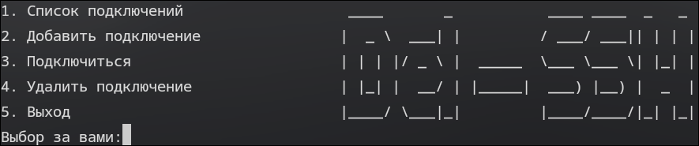

# Del-SSH
**Simple SSH manager on bash script**

<p align="center">
  
</p>

# READ BEFORE INSTALLATION

**CONFIG FILE IN ~/.ssh_servers**

```
nano .ssh_servers
vim .ssh_servers
nvim .ssh_servers 
```

*All your servers and other things that you specified are added there.*
*Something like this*

<p align="center">
  
</p>

**I'm not sure if this will work well.**
*But in my case, everything worked perfectly.*
*Actually, I did it for my own purposes. I hope this will be useful to someone too.*

**RUSSIAN LANGUAGE ONLY**

# INSTALLATION
```
git clone https://github.com/delfel25/Del-SSH.git
cd Del-SSH
chmod +x DelSSH.sh
./DelSSH.sh
```
