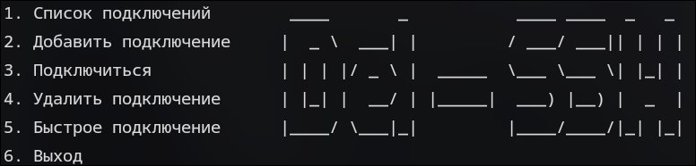
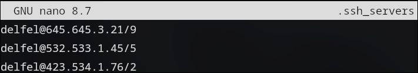

# Del-SSH
**Simple SSH manager on bash script**

<p align="center">
  
</p>

# READ BEFORE INSTALLATION

**CONFIG FILE IN ~/.ssh_servers**

```
nano .ssh_servers
vim .ssh_servers
nvim .ssh_servers 
```


*All your servers and other things that you specified are added there.*
*Something like this*

<p align="center">
  
</p>

**THIS MAY NOT WORK WELL.**
*since I haven't tested anything yet*

**RUSSIAN LANGUAGE ONLY**
